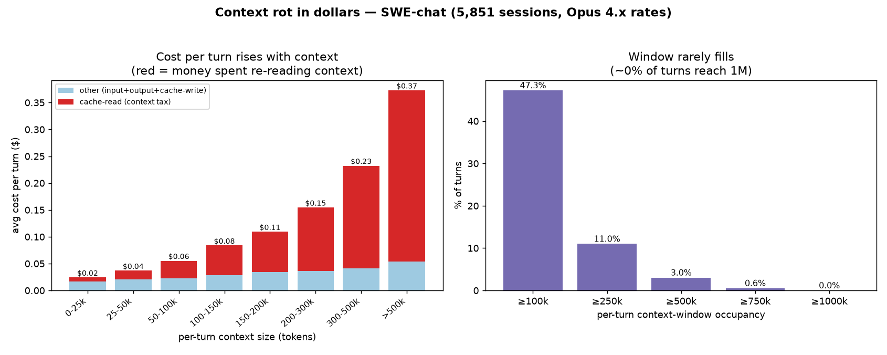

# Context Rot — The Money Cost (SWE-chat)

**Question:** When an agent's context window gets heavy, how much extra money does
that cost — per session, and per turn?

**Data:** `SALT-NLP/SWE-chat`, all **5,851 sessions** / **364,173 API calls**.
Dollar figures are **token-based estimates** at a token-weighted blended rate of
**\$4.75 in / \$23.75 out per MTok** (the data is ~all Claude Opus 4.x).
Models here have a **1M-token context window**.

> **What "cache read" means.** The model is stateless, so every turn re-sends the
> whole conversation so far. *Cache read* is the cost of re-feeding that
> accumulated history each turn (billed at 0.1× input — a 90% discount). It is the
> money you pay purely to **carry context**, as opposed to fresh input (1×) or
> generated output (~5×). It grows every turn as history piles up — the financial
> signature of context rot.

---

## Headline numbers

| Metric | Value |
|---|---|
| Avg cost / session | **\$8.31** |
| Median cost / session | \$1.45 |
| p90 / max cost / session | \$11.61 / **\$2,501** |
| Avg cost / API call (turn) | **\$0.13** |
| Total estimated spend | ~\$48,600 |
| **Context tax (cache-read \$ ÷ total \$)** | **46.5%** |

The mean (\$8.31) sits ~6× above the median (\$1.45): a small number of long,
context-heavy sessions dominates total spend.

---

## Finding 1 — The context tax: ~46.5% of all money is re-reading context

Across the whole corpus there are **47.6B cache-read tokens vs 3.6B fresh-input
tokens** (~13× more context-carrying than new input). In dollars, **46.5% of all
spend is cache-read** — money spent re-processing old context, not doing new work.

This share is **model-independent and robust**: cache-read is always 0.1× input,
so the cache-read-vs-input dollar ratio is fixed by token counts whether you price
as Sonnet or Opus.

---

## Finding 2 — Going "heavy" is where the money goes

**Heavy = a turn whose context exceeds a threshold T.** With a 1M-token window,
T = 100k is **~10% of the window** — the point where per-turn cost starts to
accelerate (it's also right at the median turn size). Higher tiers (250k, 500k)
are "very heavy" but increasingly rare.

### Per-turn cost by heavy threshold

This table is **turn-level, pooled across all 5,403 sessions** — every billed turn
(API call) is flagged heavy/light by *its own* context size. "Heavy turns" is the
**total count of such turns across all sessions** (out of 38,549 billed turns),
**not** a per-session average and **not** restricted to heavy sessions.

| Heavy line T | Heavy turns (all sessions) | Sessions w/ ≥1 heavy turn | Avg heavy turns per heavy session | Avg \$ / heavy turn | Cache-read share | vs light turn |
|---|---|---|---|---|---|---|
| **100k** (10% of window) | 18,222 (47.3% of turns) | **2,075 (38.4%)** | 8.8 | \$0.132 | 74% | **2.7×** |
| **250k** (25%) | 4,247 (11.0%) | 158 (2.9%) | 26.9 | \$0.257 | 83% | **3.8×** |
| **500k** (50%) | 1,170 (3.0%) | 31 (0.6%) | 37.7 | **\$0.373** | **86%** | **4.7×** |

The heavier the turn, the more it costs **and** the larger the share that is pure
context-carrying. At 500k a turn averages **\$0.37**, of which **~\$0.32 (86%) is
cache-read waste** — about **4.7× a light turn**.

Note the **concentration**: 250k+ turns occur in only ~158 sessions and 500k+
turns in just **31 sessions** (~38 heavy turns each). The very-heavy tail is a
handful of monster sessions (the ones behind the \$2,501 max) — so the 250k/500k
rows are indicative; the bulk of heavy turns live in the **100k–250k** band.

### Rot curve — cost per turn vs context size (left panel of chart)

| Context size of the turn | Avg \$/turn |
|---|---|
| 0–25k | \$0.02 |
| 25–50k | \$0.04 |
| 50–100k | \$0.06 |
| 100–150k | \$0.08 |
| 150–200k | \$0.11 |
| 200–300k | \$0.15 |
| 300–500k | \$0.23 |
| **>500k** | **\$0.37** |

Cost climbs ~15× from the lightest to heaviest band, and the red **cache-read
(context tax)** portion grows from a sliver to the overwhelming majority.

### At the session level

- **38% of sessions go heavy** (their peak turn crosses 100k → 2,075 sessions).
- **Share** of a heavy session's cost incurred **after** it goes heavy (the robust
  finding — a ratio, unaffected by the sampling caveat below):
  - **per-session average: ~75%** (median **85%**) — the typical heavy session.
  - **pooled across all heavy sessions: ~87%** — total post-heavy \$ ÷ total \$;
    runs higher because it's dominated by the few giant sessions.
- ~**71%** of a heavy session's turns are post-heavy, and those post-heavy turns are
  **pricier each** (~2× a pre-heavy turn) — so cost concentrates after the crossing.
- Context **starts high and climbs fast**: the first recorded billed turn already
  has ~50k median context, and **12% of sessions are >100k on their first recorded
  turn** — agentic turns ingest whole files / large tool outputs, so 100k is hit in
  only a handful of real turns.

> ⚠️ **Sampling caveat.** The `conversations` table records tokens on only ~11% of
> real API calls (38,549 billed turns vs 364,173 `api_call_count` in `sessions`).
> So absolute *turn counts* and *per-session \$ split* derived from it (e.g. "3.4
> turns / \$0.19 before vs 10.2 turns / \$1.24 after") are **undercounts** and do not
> reconcile with the authoritative **\$8.31/session**. Use them only as **ratios**;
> for absolute per-session totals, trust the `sessions` table.

---

## How full does the window actually get? (right panel of chart)

A turn's context is **rarely anywhere near the 1M limit.** Per-turn context size:
median **95k**, p90 **268k**, p99 **675k**, max **1.06M** (a single outlier turn).

| Context ≥ threshold | % of turns | % of sessions (by peak turn) |
|---|---|---|
| ≥ 100k | 47.3% | 38.4% |
| ≥ 250k | 11.0% | 2.9% |
| ≥ 500k | 3.0% | 0.6% |
| ≥ 750k | 0.6% | 0.1% |
| ≥ 1M | ~0.0% | ~0.0% |

> **Note:** an earlier draft said "~55% of sessions exceed 1M" — that referred to
> *cumulative cache-read tokens summed over all turns*, which is a different
> quantity from window occupancy. **Essentially no session fills the 1M window**;
> only **0.6%** ever peak above 500k.

---

## Direct answer

Once a turn's context goes heavy (>100k tokens, approx. 10% of the 1M window), it costs
about **\$0.13**, of which roughly **\$0.10 (about 74%) is spent purely re-reading
the accumulated context** — versus ~$0.05/turn (55% context) for a light turn. So
going heavy adds **~$0.08 per turn**, and the "context tax" per heavy turn is
**approx.\$0.10**. It scales further with size: a >500k-token turn averages **\$0.37/turn**
(~86% context tax, ~4.7× a light turn). Because ~87% of a heavy session's spend
lands after it goes heavy, the long-context tail is where context rot becomes real
dollars.

---

## Caveats

1. **Estimates, not bills** — token counts × public Anthropic rates.
2. **Two tables, two roles** — absolute dollars come from the complete `sessions`
   aggregates; per-turn shape (thresholds, rot curve, occupancy) comes from
   `conversations`, whose per-row token columns undercount *totals* ~10–100× and
   so are used only for *shape*, not totals.
3. **Money only** — this measures the *dollar* cost of heavy context. Context rot
   is also a *quality* effect (degradation as the window fills) that this analysis
   does not capture.

*Artifacts: `context_rot_cost_full.py` (per-call analysis), `context_rot_chart.py`
(chart), `context_rot_curve.png` (figure).*

---

## Conclusion

**Source reliability**

- **`sessions` table — most trustworthy.** It aggregates 100% of token usage per
  session, so all absolute figures (avg 8.31 USD/session, total spend, and the
  **46.5% context tax**) rest on full coverage.
- **`conversations` table — also good, used for shape.** Reliable for per-turn
  *structure* (the rot curve, heavy-vs-light, before/after ratios), but it records
  tokens on only ~11% of API calls, so its absolute counts and per-session dollar
  splits are undercounts.
- **Together:** take **totals from `sessions`** and **structure from
  `conversations`** — they give one consistent picture.

**Bottom line.** Context rot is expensive: roughly **half of all spend (46.5%) goes
to re-reading accumulated context**, and within the sessions that go heavy
(>100k tokens), about **87% of their cost is incurred *after* they go heavy**
(~75% per typical session). The money lives in the long-context tail — once a
session goes heavy, that's where almost all the dollars are spent.
